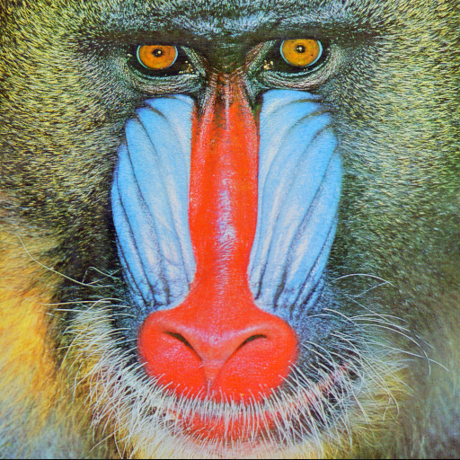
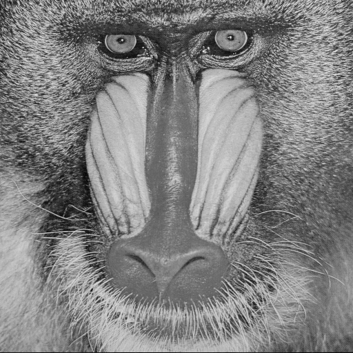

# CS-GY 6533 A – Interactive Computer Graphics - Fall 2021

### Assignment 1

*Yangfan Zhou*

<yz8338@nyu.edu>

# Implementation & Result

## Task 1: Image Class

For this task, I implemented a general image class *MyImageClass*. This class contains constructors: MyImageClass() and MyImageClass(const char* filename), which are used for creating default empty image and loading image. It also has the *save* method, which can save images in "P2", "P3" or "P5", "P6" formats. 

The class has private members: imageType, width, height, max, and data (stored the pixel values as vector<int>). And the default constructor create an empty image by setting its private members as follows:
```bash
MyImageClass::MyImageClass() {
    imageType = "P3";
    width = 512;
    height = 512;
    max = 255;

    vector<int> newImageData;
    for (int i = 0; i < 786432; i ++) {
        newImageData.push_back(0);
    }
    data = newImageData;
}
```
  
As for reading image, we use constructor MyImageClass(const char* filename). When we read in a image, the constructor will first get a line to store the imageType. Then, it store ASCII and binary format file differently according to imageType. For the ASCII format, it just reading all integers (ignore comments) and store them in data vector. For the binary format, it allocates a buffer and use read(buffer, size) to read the pixel values.
  
As for saving image, the *save* method will first specify the image format by imageType. If the image is in p2 or p3 format, output all integers in data vector to the output file. Otherwise, use *write* function to output *data* as binary.

All other tasks are also done within *MyImageClass*.

By using given pictures *Mandrill.ppm* and *Mandrill-gray.ppm*, let us test reading and saving pictures by:
```bash
MyImageClass image1("../../images/Mandrill.ppm");
image1.save("../../images/p3/changed_pic.ppm");
```
  and
```bash
MyImageClass image1("../../images/Mandrill-gray.ppm");
image1.save("../../images/p6/changed_pic.ppm");
```
The results are saved in *p3* and *p6* directories respectively as follows:





## Task 2: Operations on Images

I use C++'s operator overloading to implement this task. Basically, for each operation which contains two input images(like +, +=, -, -=), it first check whether their sizes are the same, then compute operations on vector. 
        
Here are the code for addition: (other operations are also similar)
```bash
MyImageClass MyImageClass::operator+(MyImageClass image) {
    MyImageClass newImage;
    vector<int> newImageData;
    int sum;

    // Check size
    if (this->width == image.width && this->height == image.height) {
        // Addition
        newImage.imageType = image.imageType;
        newImage.width = image.width;
        newImage.height = image.height;
        for (int i = 0; i < image.data.size(); i ++) {
            sum = (this->data).at(i) + image.data.at(i);
            newImageData.push_back(sum);
        }
        newImage.data = newImageData;
        newImage.max = max;
    } else {
        cout << "The images must be the same size! \n";
    }
    return newImage;
}
```

        
        
## Task 3: Gamma Correction

## Task 4: Alpha Compositing


# Compilation Instructions

```bash
cd Assignment_1
mkdir build
cd build
cmake ../ # re-run cmake when you add/delete source files
make # use "cmake --build ." for Windows
```

