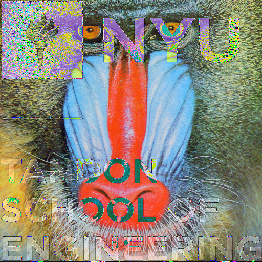
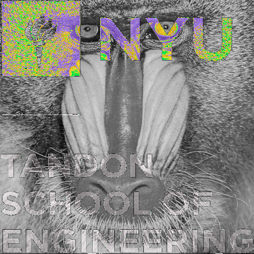

# CS-GY 6533 A – Interactive Computer Graphics - Fall 2021

### Assignment 1

*Yangfan Zhou*

<yz8338@nyu.edu>

# Implementation & Result

## Task 1: Image Class

For this task, I implemented a general image class *MyImageClass*. This class contains constructors: MyImageClass() and MyImageClass(const char* filename), which are used for creating default empty image and loading image. It also has the *save* method, which can save images in "P2", "P3" or "P5", "P6" formats. 

The class has private members: imageType, width, height, max, and data (stored the pixel values as vector<int>). And the default constructor create an empty image by setting its private members as follows:
```bash
MyImageClass::MyImageClass() {
    imageType = "P3";
    width = 512;
    height = 512;
    max = 255;

    vector<int> newImageData;
    for (int i = 0; i < 786432; i ++) {
        newImageData.push_back(0);
    }
    data = newImageData;
}
```
  
As for reading image, we use constructor MyImageClass(const char* filename). When we read in a image, the constructor will first get a line to store the imageType. Then, it store ASCII and binary format file differently according to imageType. For the ASCII format, it just reading all integers (ignore comments) and store them in data vector. For the binary format, it allocates a buffer and use read(buffer, size) to read the pixel values.
  
As for saving image, the *save* method will first specify the image format by imageType. If the image is in p2 or p3 format, output all integers in data vector to the output file. Otherwise, use *write* function to output *data* as binary.

All other tasks are also done within *MyImageClass*.

By using given pictures *Mandrill.ppm* and *Mandrill-gray.ppm*, let us test reading and saving pictures by:
```bash
MyImageClass image1("../../images/Mandrill.ppm");
image1.save("../../images/p3/changed_pic.ppm");
```
  and
```bash
MyImageClass image1("../../images/Mandrill-gray.ppm");
image1.save("../../images/p6/changed_pic.ppm");
```
The results are saved in *p3* and *p6* directories respectively as follows:


## Task 2: Operations on Images

I use C++'s operator overloading to implement this task. Basically, for each operation which contains two input images(like +, +=, -, -=), it first check whether their sizes are the same, then compute operations on vector. 
        
Here are the code for addition: (other operations are also in similar structure)
```bash
MyImageClass MyImageClass::operator+(MyImageClass image) {
    MyImageClass newImage;
    vector<int> newImageData;
    int sum;

    // Check size
    if (this->width == image.width && this->height == image.height) {
        // Addition
        newImage.imageType = image.imageType;
        newImage.width = image.width;
        newImage.height = image.height;
        for (int i = 0; i < image.data.size(); i ++) {
            sum = (this->data).at(i) + image.data.at(i);
            newImageData.push_back(sum);
        }
        newImage.data = newImageData;
        newImage.max = max;
    } else {
        cout << "The images must be the same size! \n";
    }
    return newImage;
}
```
        
Whereas for subtraction and subtraction assignment, I use clamp(diff, 0, max) to limit the pixel value between 0 and max. For addition assignment, I average the summation. For multiplication and multiplication assignment, I convert the float product into int to avoid overflow and underflow. Finally, for array index operator, grab the rgb data and store them in a pixel vector.
        
Then I use the following code in main.cpp to run these operations:
        
```bash
int main(int argc, char* argv[]) {

    try {
        MyImageClass image1("../../images/Mandrill.ppm");
        MyImageClass image2("../../images/tandon_stacked_color.ppm");

        // Task 1 //
        image1.save("../../images/p3/changed_pic.ppm");

        // Task 2 //
        // Add Image 1 and 2 and assign result to image 3
        MyImageClass image3;
        image3 = image1 + image2;
        image3.save("../../images/p3/add_pic.ppm");

        // Addition assignment plus mirroring on X axis
        MyImageClass image4;
        image4 += image3;
        image4.mirrorX();
        image4.save("../../images/p3/mirror_pic.ppm");

        // Subtract Image 2 from Image 1 and assign result to image 5
        MyImageClass image5;
        image5 = image1 - image2;
        image5.save("../../images/p3/subtract_pic.ppm");

        // Subtraction assignment
        MyImageClass image6 = image1;
        image6 -= image2; // identical with image5
        image6.save("../../images/p3/subtract_as_pic.ppm");

        // Multiplication by scalar
        MyImageClass image7 = image1 * 0.5;
        image7.save("../../images/p3/mul_pic.ppm");

        // Multiplication assignment
        MyImageClass image8 = image1;
        image8 *= 0.5; // identical with image7
        image8.save("../../images/p3/mul_as_pic.ppm");

        // Task 3 //
        //Gamma correction
        MyImageClass image9 = image1.Gamma(2.0);
        image9.save("../../images/p3/gamma_pic1.ppm");

        MyImageClass image10 = image1.Gamma(0.5);
        image10.save("../../images/p3/gamma_pic2.ppm");

        // Alpha compositing
        MyImageClass image11 = image1.Alpha(image1, image2, 0.5); // alpha = 0.5
        image11.save("../../images/p3/alpha_pic1.ppm");

        MyImageClass image12 = image1.Alpha(image1, image2, 0.85); // alpha = 0.85
        image12.save("../../images/p3/alpha_pic2.ppm");


    } catch(exception& e) {
        std::cout << "Error: " << e.what() << std::endl;
    }

    return 0;
}
```

The results for this task are as follow:
* addition
        

        
* addition assignment (average) & mirrorX()
        

        
* subtraction (using clamp)
        

        
* subtraction assignment
        

        
* multiplication (handle overflows and underflows)
        

        
* multiplication assignment
        

        
* array index operator (used in mirrorX())
        

As for image format other than "P3", I also use "Mandrill-gray.ppm" as image1 to test. And here are the results:
        
* addition
        

        
* addition assignment (average) & mirrorX()
        

        
* subtraction (using clamp)
        

        
* subtraction assignment
        

        
* multiplication (handle overflows and underflows)
        

        
* multiplication assignment
        

        
* array index operator (used in mirrorX())
        
        
## Task 3: Gamma Correction
        
This task is implemented in Gamma method of MyImageClass as follow:
        
```bash
MyImageClass MyImageClass::Gamma(double g) {
    MyImageClass newImage;
    float max_f = (float)max;
    for(int i = 0; i < data.size(); i ++) {
        double temp = pow((double)(data.at(i)/max_f), g) * max_f;
        newImage.data.at(i) = (int)temp;
    }
    return newImage;
}
```

Here are the results when using *Mandrill.ppm*:
       
* gamma = 2.0
        

        
* gamma = 0.5
        


Here are the results when using *Mandrill-gray.ppm*:
        
* gamma = 2.0


        
* gamma = 0.5
        

        
        

## Task 4: Alpha Compositing

This task is implemented in Alpha method of MyImageClass as follow:
        
```bash
MyImageClass MyImageClass::Alpha(MyImageClass front, MyImageClass back, double a) {
    MyImageClass newImage = front * a + back * (1-a); // use overloaded operator
    return newImage;
}
```
       
Here are the results when using *Mandrill.ppm* as front and *tandon_stacked_color.ppm* as back:
       
* alpha = 0.5
        

        
* alpha = 0.85
        


Here are the results when using *Mandrill-gray.ppm* as front and *tandon_stacked_color.ppm* as back:
        
* alpha = 0.5


        
* alpha = 0.85
        


## Optional Task
        
I use dilate and erode method within MyImageClass to implement morphological operations on *Mandrill.ppm*. They generally use structure element {1,1,1,1,1,1,1,1,1} to map each pixel and found the max / min value on the map and assign the value to the central. Then I subtract the erode image from the dilate image, and got the following result:
        


# Compilation Instructions

```bash
cd Assignment_1
mkdir build
cd build
cmake ../ # re-run cmake when you add/delete source files
make # use "cmake --build ." for Windows
```

